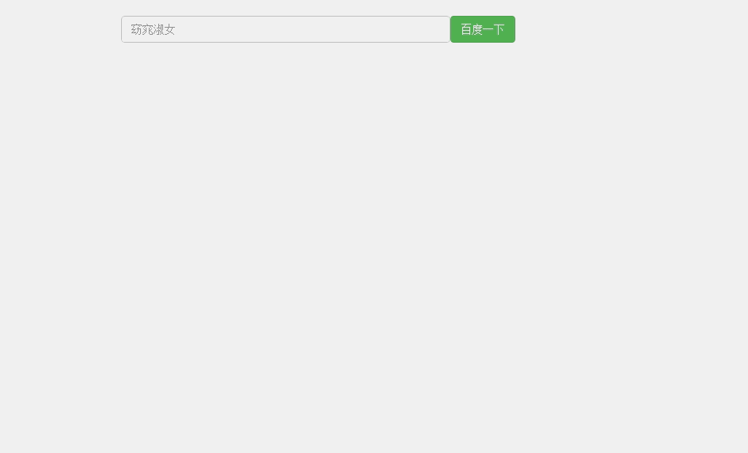

# 用vuejs仿百度一下（随性写）
# 涉及到跨域请求，暂时用jquery封装的jsonp请求接口。
# 具体demo截图

## 技术栈

 - vue2.0（核心框架）
 - jsonp （接轨百度jsonp接口）

# 跨域可以使用谷歌的插件解决: 参考https://chrome.google.com/webstore/detail/allow-control-allow-origi/nlfbmbojpeacfghkpbjhddihlkkiljbi